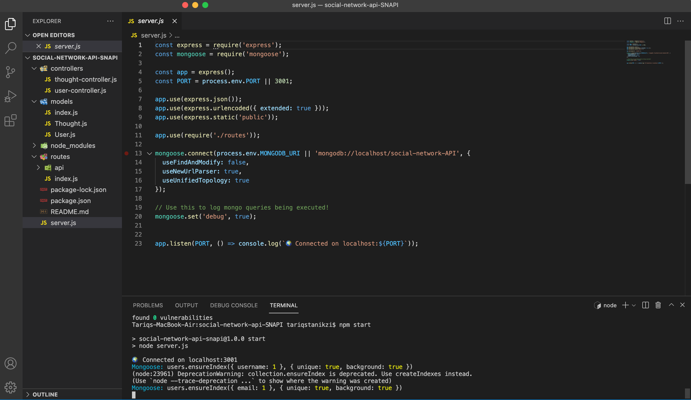

# Social-Network-API-SNAPI

## Description:
This is APIs for a social network This application is meant to show the use of mongoDB in a social media setting. which can  handle large amount of unstructured data, for routing used Express.js, Mongoose ODM and moment package for format time.

## Acceptance Criteria:

- When you enter the command to invoke the application then the server is started and the Mongoose models are synced to the MongoDB database.  
- Testing API GET routes in Insomnia Core for users and thoughts return the data for each of these routes in a formatted JSON
- Testing API POST, PUT, and DELETE routes in Insomnia Core are able to successfully create, update, and delete users and thoughts

- Testing API POST and DELETE routes in Insomnia Core are able to successfully create and delete reactions to thoughts and add and remove friends to a user’s friend list.

## Installation:
 
 Download the repo files from this link https://github.com/Tariqstanikzai/social-network-api-SNAPI You must then install mongoose, express and moment or just run npm i from the command line, which i writed below:
    - npm init -y
    - npm i express
    - npm i mongoose
    - npm i moment

    npm start
    Then open Insomnia to test API routes

## Walkthrough Videos

## Screenshots

## Technologies Used:
Mongoose
Express
MongoDB
Node.js

## Contributor:
Tariq Stanikzai 

